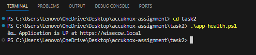
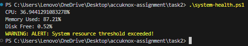

# 🧠 Task 2 — System & Application Health Monitoring

This task implements two PowerShell scripts on Windows to monitor system health and check application availability.


## 🧰 Prerequisites

- Windows PowerShell 5.1
- Kubernetes & Wisecow app running with Ingress
- Hosts file updated with:
- 127.0.0.1 wisecow.local


---

## 📌 1. System Health Monitoring — `system-health.ps1`

Checks CPU, memory, and disk usage. Alerts if CPU > 80%, memory > 80%, or disk free < 10%.

### Run:
```powershell
cd task2
.\system-health.ps1
````

### Example Output:

```
CPU: 12.54%
Memory Used: 42.18%
Disk Free: 67.23%
```

---

## 📌 2. Application Health Checker — `app-health.ps1`

Checks whether the **Wisecow application** is reachable at [https://wisecow.local](https://wisecow.local).
Uses a .NET policy override to bypass self-signed TLS errors (PowerShell 5.1 compatible).

### Run:

```powershell
cd task2
.\app-health.ps1
```

### Example Output:

```
✅ Application is UP at https://wisecow.local
```

If the app is down or ingress misconfigured:

```
❌ Application is DOWN or not reachable at https://wisecow.local
```

---
##  🖼️ Screenshots 

**Here's screenshot of app-health.ps1 teminal :**  



**Here's a scrrenshot of system-health.ps1 terminal :** 



## 📝 Notes

* `app-health.ps1` works with **self-signed certificates** — no manual certificate trust needed.
* No external modules are required — both scripts use built-in PowerShell and .NET classes.
* For PowerShell 7+, `-SkipCertificateCheck` can be used instead of the .NET policy.